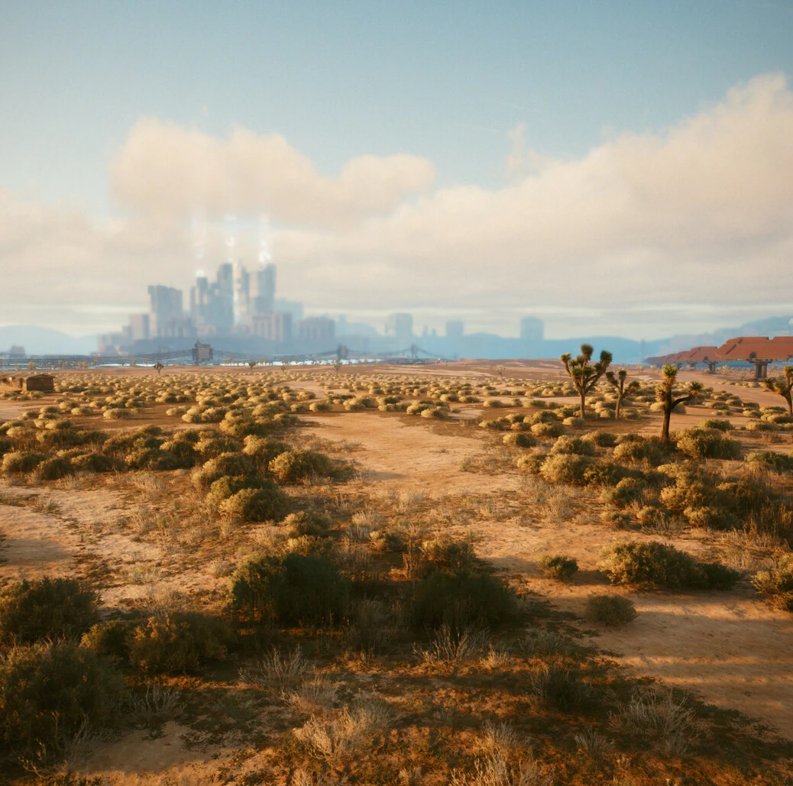
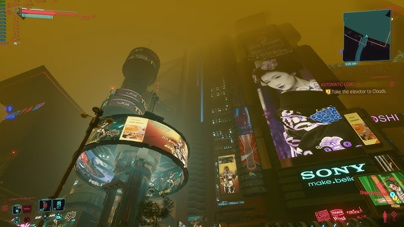
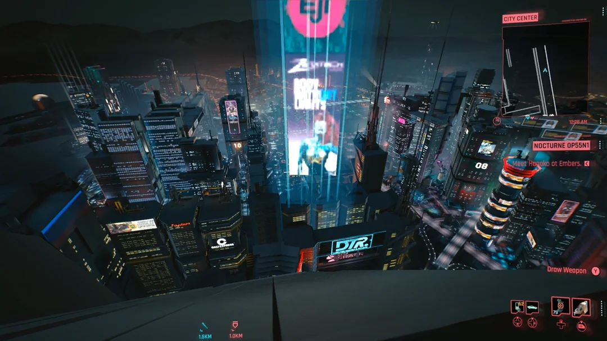
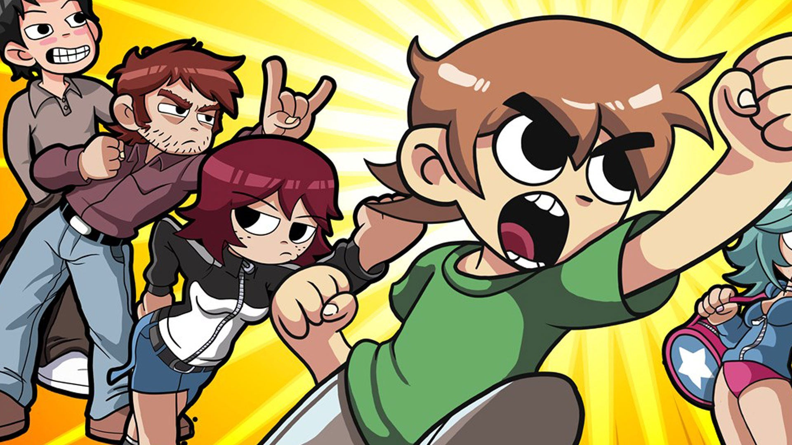

# Historia
**Luis Diaz - Director de Escritura**

## Intro

Pantalla negra - Aparecen letras en color blanco en estilo pixel art "Año 2069"

Aparece en la pantalla una vista del paisaje de esta ciudad futurista de cyberpunk, con varios edificios enormes impoenetes de esta ciudad fururista, los edifcios son grises y sin vida lo unico que tiene color son los anuncios que llenan el cielo de la ciduad.

Ahora estamos dentro de la ciudad vemos como varias personas usando su ciberlink ven anuncios a su alrededor, mientras vemos que los imponentes edificios tienen en sus costados anuncios de publicicdad enormes(tipo Blade Runner) no hay un espacio que no este cubierto por un anuncio. Aparce en letras blancas *"La megacorporacion X provio al mundo del ciberlink una herramienta para mejorar sus vidas de forma gratuita*"*

Cambiamos a otra vista de la ciudad, la terraza de uno de los edificios mas altos de la ciudad hay gente en la terraza del edificio disfurtando el cielo de noche pero de repente el cielo nocturno se cubre de varios anuncios que nublan las estrellas del cielo *"La megacorporacion X no tardo en saturar a todos los usuarios del ciberlink con anuncios a todo el tipo de productos y servicios."*

La pantalla se torna en negro en letras blancas *"Alguien tenia que detenerlos"*.

La pantalla se divide de en cuatro vemos cuatro personajes(jovenes dentre 21 y 24 años, tres masculinos y una mujer) aparecen en cada uno de los cuadros, todos tienen diademas con microfonos y estan sentados viendo al centro de la pantalla aparece la burbuja de dialogo de uno de los amigos "Este es el dia chichos el episodio final de Doctor Who" otro personaje comenta *"Hemos esperado esto por años"* otro comenta *"No puedo creer que este vivo para presenciar esto"* de repente la pantalla se torna en negros y aparece el anuncio *"Este episodio es traido a ustedes por Megacorporacion X"* Aparecen burbijas de comentarios de todos los perosnajes alrededor del anuncio diciendo *"Odio los anuncios"* y cuando desaparece el logo de Megacorporacion X la pantalla se satura de pequeños y medianos anuncios cubriendo toda la pantalla e impiedieno a los amigos ver su serie.

Ahora aparecemos en el cuarto del protagonista el cual estalla antes los anuncios y toma su monitor y lo lanza por la ventana de su cuarto, diciendo *"Ya estoy harto de estos anuncios!!!!!!"* y ahora aparecen sus amigos en viñetas de comic reaccionando con el emoticon de *😲*. Ahora cambiamos a una vista en primera persona y el protagonista señala con el dedo hacia el horizonte donde vemos cinco edificos enormes y uno erguiendose en medio de ellos con el nombre de la Megacorporacion X y el protagonista dice en una viñeta de comic *"Es hora de acabor con los anuncios"*

**Let's Fucking GOOOOOOO!!!**

Aparece el protagonista señalando hacia las compañias de anuncio y sus tres amigos detras de el.
---